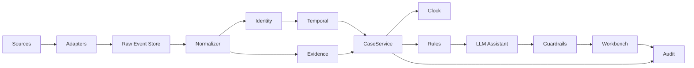

# Architecture

```mermaid
flowchart LR
    Sources --> Adapters --> RawStore[Raw Event Store] --> Normalizer --> Identity
    Identity --> Temporal --> CaseService
    Normalizer --> Evidence --> CaseService
    CaseService --> Clock
    CaseService --> Rules --> LLM[LLM Assistant] --> Guardrails --> Workbench
    Workbench --> Audit
    CaseService --> Audit
```
